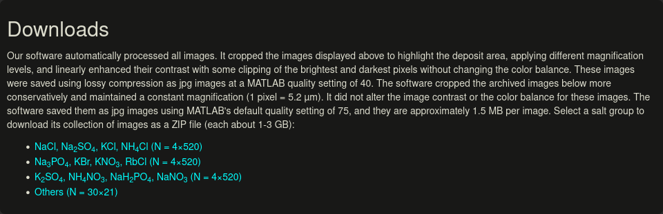
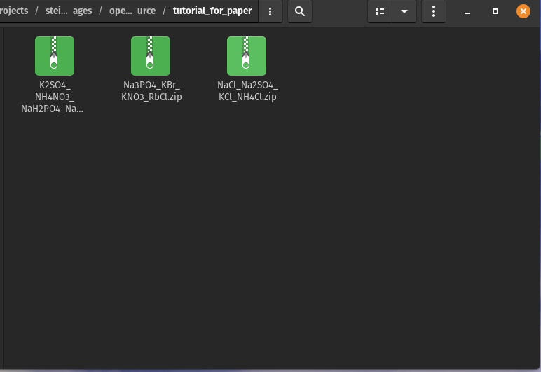
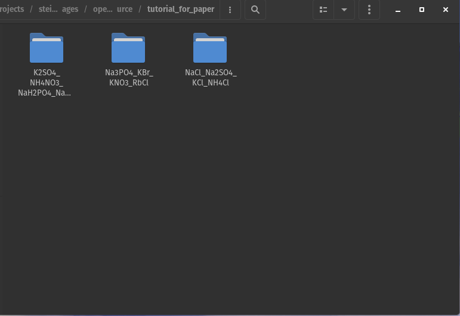
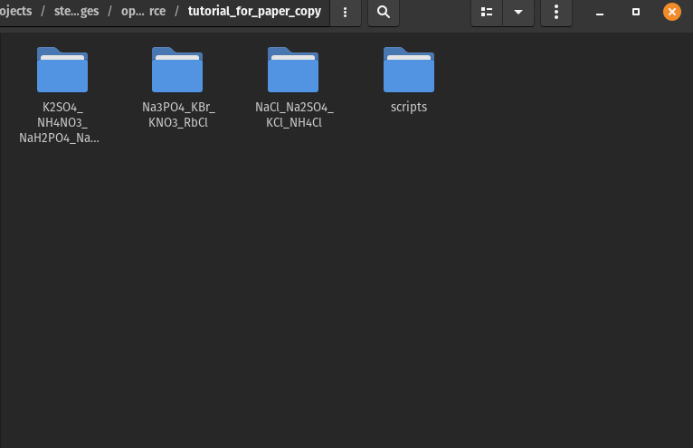
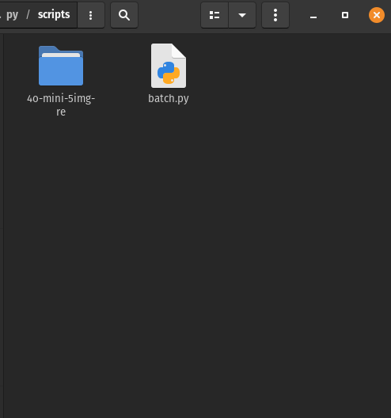

# Analysis Guide

## Full Testing

This section is intended for those wishing to replicate the testing done in "Evaluation of GPT-4o and GPT-4o-mini’s Vision Capabilities for Compositional Analysis from Dried Solution Drops".

Sections of this tutorial assume you use Linux or MacOS; for Windows users, alternatives will be required for the following: 

1) Mass renaming files to random numbers across directories
2) Mass resizing images across directories

Potential alternatives:
[Bulk Rename Utility](https://www.bulkrenameutility.co.uk/)

[XnConvert](https://www.xnview.com/en/xnconvert/)

### Steps

1. First, navigate to the download page for the images:  [https://www.chem.fsu.edu/~steinbock/saltscapes.php](https://www.chem.fsu.edu/~steinbock/saltscapes.php)
2. Scroll down to the section that says "Downloads", as shown in this image.
   
3. Download the first 3 ZIP files (do not download the "Others" file).
4. Create a new, empty folder and move the ZIP files there. It should look similar to the image below.
   
5. Extract the 3 ZIP files (and, optionally, remove them after extraction) so that your folder now looks like this:
   
6. Now, open your terminal.
7. First, install ImageMagick via:
   ```
   sudo apt-get install imagemagick 
   ```
8. Then, [navigate](https://terminalcheatsheet.com/guides/navigate-terminal) to the directory that contains your 3 image folders.
9. Run the following command to resize all the images to 600x600 (may take some time). You can copy and paste it in as one line and hit enter.

```
total=$(find . -type f \( -iname '*.jpg' -o -iname '*.jpeg' -o -iname '*.png' \) | wc -l); count=0; find . -type f \( -iname '*.jpg' -o -iname '*.jpeg' -o -iname '*.png' \) | while read -r file; do count=$((count + 1)); printf "\rProcessing: %d/%d" "$count" "$total"; mogrify -resize 600x600\> "$file"; done; echo
```

10. Next, run this command to rename all the files to random numbers and normalize the image metadata. This may also take a while.

```
total=$(find K2SO4_NH4NO3_NaH2PO4_NaNO3 Na3PO4_KBr_KNO3_RbCl NaCl_Na2SO4_KCl_NH4Cl -type f | wc -l); count=0; find K2SO4_NH4NO3_NaH2PO4_NaNO3 Na3PO4_KBr_KNO3_RbCl NaCl_Na2SO4_KCl_NH4Cl -type f -print0 | while IFS= read -r -d '' file; do count=$((count + 1)); new_name=$(shuf -i 100000000-999999999 -n 1); mv "$file" "$(dirname "$file")/$new_name.jpg"; exiftool -overwrite_original -ModifyDate="2000:01:01 00:00:00" -CreateDate="2000:01:01 00:00:00" -DateTimeOriginal="2000:01:01 00:00:00" "$(dirname "$file")/$new_name.jpg"; echo "Processed $count / $total files"; done
```

11. Run this command to check for any duplicate names.

```
find K2SO4_NH4NO3_NaH2PO4_NaNO3 Na3PO4_KBr_KNO3_RbCl NaCl_Na2SO4_KCl_NH4Cl -type f -exec basename {} \; | sort | uniq -d
```

12. If no file names are printed after running that command, then move on to step 14. If any file names are printed to your terminal, then run this command, and go back to step 11 after.

```
find K2SO4_NH4NO3_NaH2PO4_NaNO3 Na3PO4_KBr_KNO3_RbCl NaCl_Na2SO4_KCl_NH4Cl -type f -exec basename {} \; | sort | uniq -d | while read filename; do find K2SO4_NH4NO3_NaH2PO4_NaNO3 Na3PO4_KBr_KNO3_RbCl NaCl_Na2SO4_KCl_NH4Cl -type f -name "$filename" -print0 | while IFS= read -r -d '' file; do new_name=$(shuf -i 100000000-999999999 -n 1); mv "$file" "$(dirname "$file")/$new_name.jpg"; exiftool -overwrite_original -ModifyDate="2000:01:01 00:00:00" -CreateDate="2000:01:01 00:00:00" -DateTimeOriginal="2000:01:01 00:00:00" "$(dirname "$file")/$new_name.jpg"; done; done
```

13. Now, all your image files are ready. Create a new folder in your directory with the 3 originally unzipped folders named "scripts".
    
14. Download the batch.py file from this repository and move it into the scripts folder.
15. Edit the batch.py file, changing the variable `batch_folder_name` to a name of your choice. Then, make a folder in the scripts folder with the same name. For example, the default name is `4o-mini-5img-re` and the folder looks like the below image.
    
16. Also, change `max_requests_per_file` to the necessary number in order to fit within the token limits of the batch API. Note that the maximum file size is 100MB (which corresponds to 53 requests per batch). You will most likely need to lower this number.
17. In your terminal, navigate to the scripts folder and run the following:

```
python3 batch.py
```

18. You should now have a number of batch files (.JSONL files) in your folder inside of scripts. You can upload these at [https://platform.openai.com/batches](https://platform.openai.com/batches) if you have an OpenAI account and API funds (NOTE: costs may be significant; one full set of batches may cost upwards of $100). The output should also be in JSONL format with the responses to each individual request and corresponding request IDs. 🚀️
